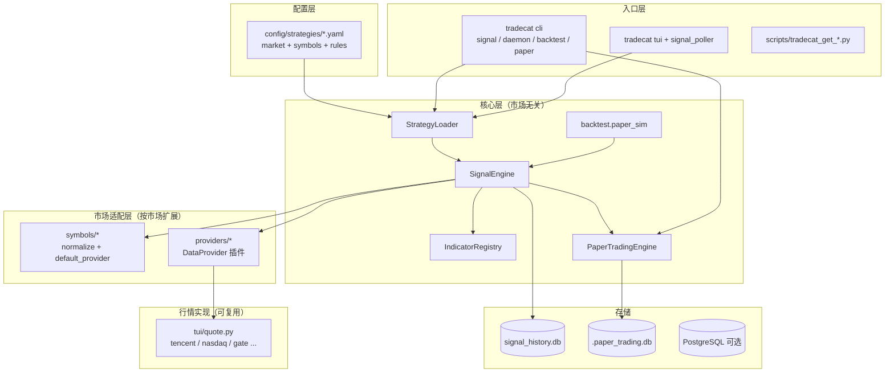
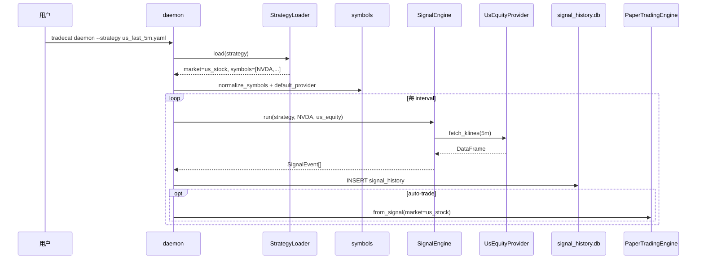

# 分层架构

## 总览

## 各层职责

| 层 | 路径 | 是否随新市场改动 |
|:---|:---|:---:|
| 策略配置 | `config/strategies/` | ✅ 新增 YAML |
| 符号 | `core/symbols/` | ✅ 新增/扩展 |
| 数据源 | `core/providers/` | ✅ 新增 Provider |
| 信号引擎 | `core/signals/` | ❌ 原则上不改 |
| 指标 | `core/indicators/` | ❌ 共用 |
| 模拟盘 | `core/paper_trading/` | ⚠️ 仅扩展归一化 |
| 回测辅助 | `core/backtest/` | ❌ 共用 |
| CLI | `cli/*.py` | ⚠️ 仅当缺 market 透传时改 |
| TUI | `tui/` | ⚠️ poller 读策略 market |

## 运行时序列（daemon 为例）

## 已接入市场状态

| market | Provider | 符号模块 | 策略示例 | 状态 |
|:---|:---|:---|:---|:---:|
| `crypto` | `gate` / `binance` | `symbols/crypto.py` | `fast_1m.yaml` | 生产 |
| `us_stock` | `us_equity` | `symbols/equity.py` | `us_fast_5m.yaml` | 已接入 |
| `hk_stock` | （待）`hk_equity` | （待）`symbols/hk.py` | （待） | 行情在 TUI |
| `cn_stock` | （待）`cn_equity` | （待）`symbols/cn.py` | （待） | 行情在 TUI |
| `cn_fund` | （待） | （待） | （待） | 行情在 TUI |

TUI `quote.py` 已支持多市场报价；核心 Provider 按上表逐个接入即可。
