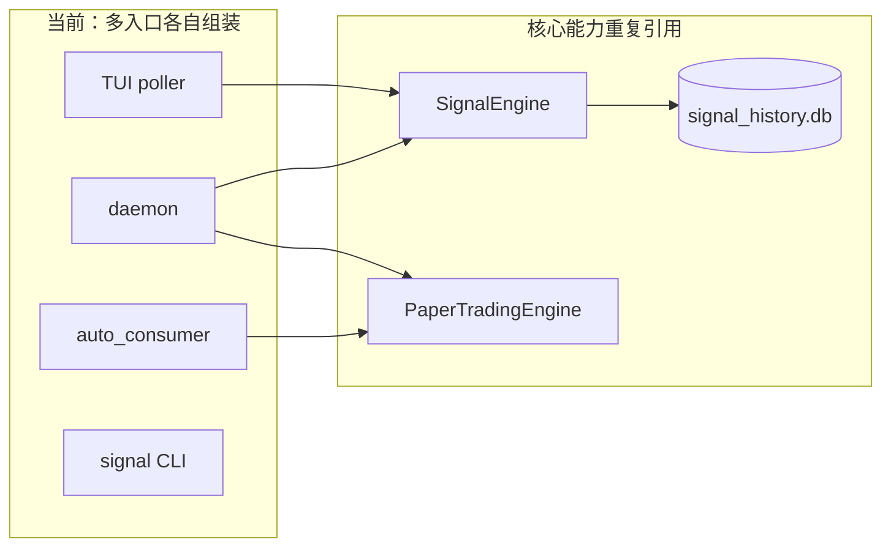
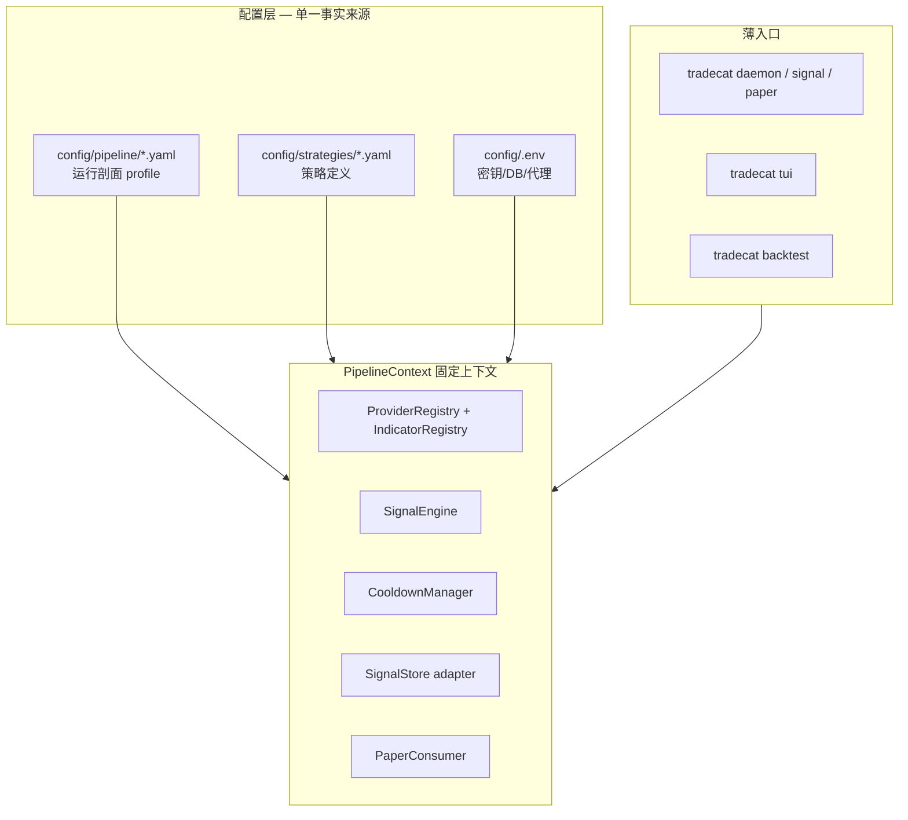

# TradeCat Pipeline 固化方案

> 目标：**一条流水线、一份上下文、多个薄入口**（CLI / TUI / daemon 不再各自拼装逻辑）。

---

## 1. 现状：为什么「东一榔头西一棒槌」

同一条业务链 **行情 → 指标 → 信号 → 落库 → 模拟盘**，目前在多处**重复装配**：

| 入口 | 路径 | 重复做了什么 |
|:---|:---|:---|
| `tradecat daemon` | `cli/daemon.py` | 注册 Provider/Indicator、SignalEngine 循环、可选 paper |
| TUI 后台 | `tui/signal_poller.py` | 同上 + 写 `signal_history.db` |
| TUI 跟单 | `tui/auto_consumer.py` | 读 SQLite → Paper（与 `core/paper_trading/consumer.py` 重叠） |
| `tradecat signal` | `cli/signal.py` | 单次 SignalEngine |
| `tradecat execute` | `cli/execute.py` | signal → order 另一条链 |

配置也分散：

- 策略：`config/strategies/*.yaml`（合理）
- 运行参数：`TUI_SIGNAL_*`、`PAPER_AUTO_*`、`daemon` 的 click 选项、`.env` 里 DB/代理

结果是：**加美股、加双策略、加按键**，都要改 2～3 个文件，很难保证行为一致。



---

## 2. 目标形态：固定 Pipeline 上下文

引入 **`PipelineContext`（或 `TradingRuntime`）**：进程内**单例**，所有入口只负责 `load_profile()` + `start()` / `run_once()`。



### 2.1 流水线阶段（固定顺序）

| 阶段 | 职责 | 实现归属 |
|:---|:---|:---|
| **S0 装配** | 读 profile + strategy，注册插件 | `PipelineContext.bootstrap()` |
| **S1 行情** | Provider.fetch_klines | 已有 `core/providers/` |
| **S2 指标+规则** | SignalEngine.run | 已有 `core/signals/` |
| **S3 持久化** | 写入 signal_history（可关） | 统一 `SignalStore` |
| **S4 消费** | 信号 → 模拟盘（可关） | 统一 `PaperConsumer` |
| **S5 观测** | 日志/metrics/Linear 评论 | 可选 |

**入口差异**只体现在 profile 开关：

| profile | S3 | S4 | 循环 |
|:---|:---:|:---:|:---|
| `cli_signal` | 可选 | 关 | 单次 |
| `daemon_live` | 开 | 开 | 定时 |
| `tui_live` | 开 | 开 | 定时 + UI 只读 |
| `backtest_offline` | 关 | 模拟 | 历史 bar 扫描 |

---

## 3. 配置文件：`config/pipeline/`（建议新增）

与 **策略 YAML** 分离：策略管「规则」，profile 管「怎么跑」。

示例 `config/pipeline/tui_dual.yaml`：

```yaml
name: tui_dual
description: TUI 加密+美股双策略实盘模拟

strategies:
  - path: current/fast_1m.yaml
    enabled: true
  - path: us_fast_5m.yaml
    enabled: true

runtime:
  poll_interval_s: 60
  min_strength: 50

stores:
  signal_history:
    path: libs/database/services/signal-service/signal_history.db  # 或 env 解析

consumers:
  paper:
    enabled: true
    markets: [crypto, us_stock]   # 或 all
    notional_pct: 0.15
    trade_cooldown_s: 180
    min_equity_ratio: 0.20

observers: []   # 未来：telegram / linear_comment
```

环境变量只保留 **一个开关**：

```bash
TRADECAT_PIPELINE_PROFILE=tui_dual   # 替代 TUI_SIGNAL_* + PAPER_AUTO_* 组合
```

`.env` 仍只管密钥与 DB URL，不再堆业务参数。

---

## 4. 代码结构（建议落地路径）

```
src/tradecat/core/pipeline/
├── __init__.py
├── base.py              # 已有 AnalysisPipeline（可保留或并入）
├── context.py           # PipelineContext：bootstrap + 持有 registries
├── profile.py           # 加载 config/pipeline/*.yaml
├── runner.py            # 定时循环：for strategy in strategies: scan symbols
├── signal_store.py      # 统一写 signal_history（从 tui/signal_poller 抽出）
└── paper_consumer.py    # 统一跟单（合并 auto_consumer + paper_trading/consumer）
```

**薄入口改造**（Phase 3）：

```python
# tui/tui.py 启动时
from tradecat.core.pipeline import PipelineContext
ctx = PipelineContext.load_profile(os.getenv("TRADECAT_PIPELINE_PROFILE", "tui_dual"))
ctx.start_background()   # poller + consumer 各一个 supervisor
```

```python
# cli/daemon.py
ctx = PipelineContext.load_profile("daemon_live")
ctx.run_forever(interval_s=60)
```

---

## 5. 与 Linear / 规则驱动的关系

| Linear Issue 类型 | Pipeline 变更 |
|:---|:---|
| 新市场 | 新 strategy YAML + Provider（不改 runner） |
| 新入口（如 API） | 新 profile 或复用 `daemon_live` |
| TUI 交互 | 只改 `tui/`，**不改** S1–S4 |
| 回测 | profile `backtest_offline`，走 `core/backtest/` |

每个 Phase 在 Linear 开 **一条** `area:core` Issue，避免与 `area:tui` 搅在一起。

---

## 6. 分阶段实施（建议）

| 阶段 | 交付 | 风险 |
|:---|:---|:---|
| **P0 文档+配置** | 本文件 + `config/pipeline/*.yaml` 示例；`TRADECAT_PIPELINE_PROFILE` 进 `.env.example` | 低 |
| **P1 统一 Store+Consumer** | `signal_store.py` + `paper_consumer.py`；TUI 改调用；删 `auto_consumer` 重复逻辑 | 中 |
| **P2 PipelineRunner** | `daemon` / `signal_poller` 共用 `runner.py` | 中 |
| **P3 Profile 全覆盖** | TUI/CLI 只读 profile；废弃 `TUI_SIGNAL_*`（保留兼容 1 版本） | 低 |
| **P4 观测** | 结构化日志、run_id、可选 Prometheus | 低 |

**不要一步到位大重构**；P1 做完就能明显感到「固定上下文」。

---

## 7. 你现在就可以遵守的约定（无代码也能用）

1. **新功能先问**：属于 S1–S5 哪一段？是否只需新 profile？
2. **禁止**在 `tui/` 里再写一套 SignalEngine 循环；应提议进 `core/pipeline/`。
3. **策略 vs 运行**：规则进 `strategies/`；轮询间隔、是否跟单进 `pipeline/`。
4. **Linear**：Pipeline 改动用 `area:core`，标题 `pipeline: ...`。

---

## 8. 相关文档

- 市场插件：[../market-integration/ARCHITECTURE.md](../market-integration/ARCHITECTURE.md)
- Issue 规范：[../linear-issue-spec.md](../linear-issue-spec.md)
- Agent：[../../AGENTS.md](../../AGENTS.md)
